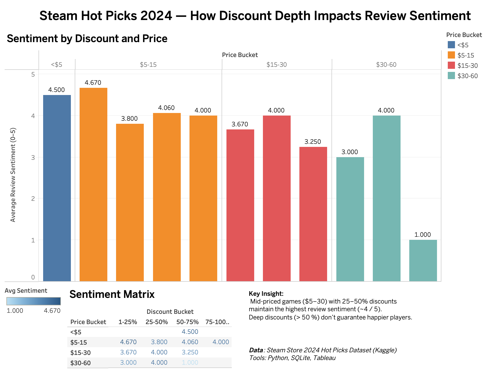

# Steam Store Sentiment Analysis 🎮

Analyzed the **2024 Steam "Hot Picks" dataset** to uncover how pricing and discount depth affect player sentiment.  
The project demonstrates an end-to-end data analytics workflow: **Python → SQL → Tableau**.

---

## 📈 Objective
Determine how game pricing and discount levels correlate with review sentiment, and identify which segments (price × discount) perform best.

---

## 🧰 Tech Stack
- **Python (Pandas, NumPy):** data cleaning & feature engineering  
- **SQLite:** aggregation and analysis via SQL  
- **Tableau Public:** dashboard visualization  
- **Dataset:** [Steam Store 2024 – Hot Picks & Reviews (Kaggle)](https://www.kaggle.com/datasets/kanchana1990/steam-store-2024-hot-picks-and-reviews)
# Dashboard
 
💡 Key Insights

- Mid-priced games ($5–30) with 25–50% discounts achieve the highest average sentiment (~4.0/5).

- Deep discounts (>50%) do not consistently improve player sentiment.

- Budget titles (<$5) perform surprisingly well when modestly discounted.
